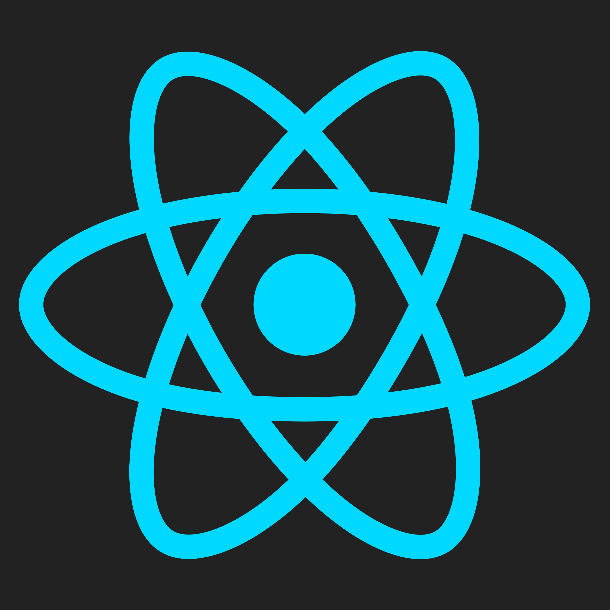
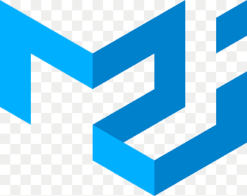
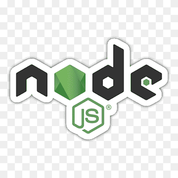
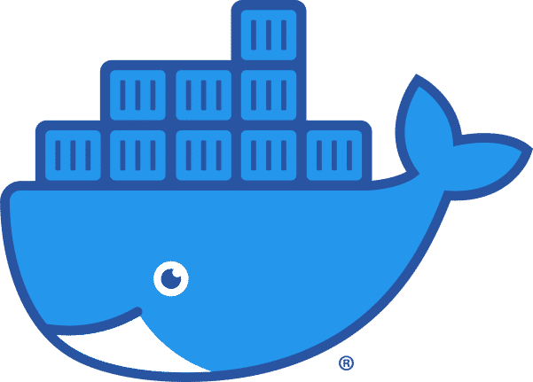

# 👋 Hi, I'm Itay Getahun

## 🚀 About Me  
I'm a **Full-Stack Developer** with expertise in **Node.js, React, and Material-UI**. I specialize in building modern, scalable web applications with clean and efficient code. Passionate about **learning new technologies**, optimizing performance, and crafting seamless user experiences.  

---

## 🛠️ Tech Stack  

### 🖥️ Frontend  
-  **React.js**  
-  **Material-UI**  
-  **TypeScript**  
-  **HTML & CSS**  

### ⚙️ Backend  
-  **Node.js & Express.js**  

### ☁️ DevOps & Cloud  
-  **Docker**  

---

## 📫 Connect With Me  
🔗 [LinkedIn](https://www.linkedin.com/in/itay-getahun/)  

---

🚀 **Open to new opportunities and collaborations!**
